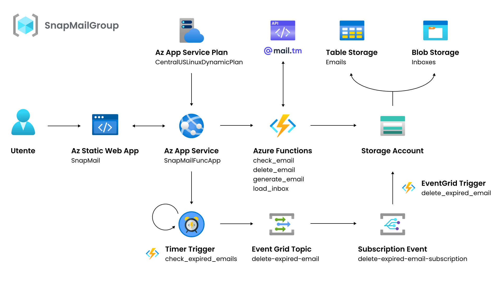

# SnapMail

SnapMail è un sistema Cloud-Based per la generazione e gestione di e-mail temporanee.

---

## Indice
- [Obiettivo e descrizione](#obiettivo-e-descrizione)
  - [Tecnologie](#tecnologie)
  - [Funzionalità](#funzionalità)
- [Architettura](#architettura)
- [Requisiti](#requisiti)
- [Descrizione cartelle](#descrizione-cartelle)
- [Replicazione e configurazione dell'infrastruttura](#replicazione-e-configurazione-dellinfrastruttura)
  - [1. Creare la repository con il progetto](#1-creare-la-repository-con-il-progetto)
  - [2. Creazione delle risorse Azure](#2-creazione-delle-risorse-azure)
    - [Eseguire lo script setup_azure_resources.sh per configurare le risorse](#eseguire-lo-script-setup_azure_resourcessh-per-configurare-le-risorse)
  - [3. Deploy delle Azure Functions](#3-deploy-delle-azure-functions)
    - [Settare le credenziali Azure](#settare-le-credenziali-azure)
    - [Deploy sulla Function App delle Azure Function](#deploy-sulla-function-app-delle-azure-function)
  - [4. Aggiungere Azure Functions Endpoints ai GitHub Secrets](#4-aggiungere-azure-functions-endpoints-ai-github-secrets)
  - [5. Deploy Azure Static Web App](#5-deploy-azure-static-web-app)
  - [6. Creazione della sottoscrizione di EventGrid](#6-creazione-della-sottoscrizione-di-eventgrid)


---

## Obiettivo e descrizione
Questo progetto mira a creare un sistema avanzato per la generazione e gestione di e-mail temporanee, con l’obiettivo di migliorare la privacy degli utenti e ridurre la loro esposizione a spam e abusi online.
Nella schermata principale, l’utente può creare indirizzi e-mail unici e temporanei, personalizzandone il nome o generandone uno casualmente. È possibile recuperare e autenticare un’e-mail ancora attiva, consultare suggerimenti e leggere le regole d’uso della piattaforma. Una volta generata l’e-mail temporanea, l’interfaccia consente di visualizzare la casella di posta in arrivo, insieme all’indirizzo completo (incluso il dominio) e alla data di scadenza.
Il sistema permette inoltre di aggiornare la casella di posta per verificare l'arrivo di nuovi messaggi, eliminare l’indirizzo senza attendere la scadenza e scaricare i messaggi ricevuti in formato JSON. L’intero processo è pensato per offrire un’esperienza semplice, sicura e intuitiva, mettendo al centro la protezione della privacy e la facilità di utilizzo.

### Tecnologie

Il progetto utilizza un’infrastruttura basata su **Microsoft Azure** e altre tecnologie:

**Microsoft Azure**:
  - **Azure Static Web App**: Per l'hosting del front-end.
  - **Azure Functions**: Per la gestione della logica di back-end e dei processi di automazione.
  - **Azure Table Storage**: Per la memorizzazione delle e-mail temporanee.
  - **Azure Blob Storage**: Per l'archiviazione dei dati relativi alle e-mail in ingresso.
  - **Event Grid**: Per la gestione automatizzata delle e-mail scadute.  

**API [mail.tm](https://docs.mail.tm)**: Utilizzata per la creazione e la gestione delle e-mail temporanee.


### Funzionalità

L'applicazione offre una serie di strumenti per la gestione delle e-mail temporanee:
- Creazione di indirizzi e-mail unici e temporanei, con la possibilità di personalizzare il nome o generarne uno casualmente.
- Ricezione dei messaggi inviati agli indirizzi generati.
- Gestione della scadenza automatica degli indirizzi, configurabile in un intervallo che va dall'istante attuale fino a un massimo di 7 giorni.
- Recupero e autenticazione di indirizzi e-mail ancora attivi.
- Esportazione della posta in arrivo in formato JSON.
- Eliminazione manuale della casella di posta, senza dover attendere la scadenza automatica.


## Architettura



## Descrizione Architettura

L'architettura dell'applicazione si basa su una configurazione serverless dei servizi offerti da **Microsoft Azure**, garantendo scalabilità e costi ottimizzati. L'interazione dell'utente avviene tramite la **Azure Static Web App**, che ospita il front-end dell'applicazione. Ogni azione dell'utente genera richieste che vengono gestite attraverso le **Azure Functions**, distribuite su una **App Service Function App**.

### Dettagli Architetturali

La **App Service Function App** fornisce il contesto di esecuzione per le singole funzioni, condividendo le stesse configurazioni e linguaggio. È associata a un **App Service Plan** configurato per eseguire le Azure Functions su Linux, consentendo un'allocazione dinamica delle risorse in base alla domanda. Questa configurazione è ideale per applicazioni leggere e a basso carico, poiché i costi sono proporzionali alle risorse effettivamente utilizzate.

### Azure Functions e Trigger

L'applicazione utilizza sei trigger principali per gestire le operazioni richieste:

- **HTTP Trigger**:
  - `check_email`: Controlla se un indirizzo e-mail è presente in **Azure Table Storage**. Se esistente, carica la posta associata e la restituisce alla web app.
  - `delete_email`: Elimina una casella di posta prima della scadenza, rimuovendo sia il record su **Azure Table Storage** sia i dati associati su **Azure Blob Storage**.
  - `generate_email`: Utilizza le API fornite da `@mail.tm` per recuperare un dominio disponibile, creare un'e-mail temporanea, autenticarla e memorizzare i dati in **Azure Table Storage**.
  - `load_inbox`: Recupera le e-mail in arrivo associate a un indirizzo temporaneo tramite le API di `@mail.tm`. I dettagli delle e-mail vengono aggregati e salvati su **Azure Blob Storage** per la visualizzazione.

- **Timer Trigger**:
  Si occupa di verificare periodicamente, in base a una schedule personalizzabile, la presenza di e-mail scadute in **Azure Table Storage**. Quando vengono trovate, genera un evento `EmailExpired` su **Event Grid**, che attiva una sottoscrizione dedicata. Questo processo richiama un **Event Grid Trigger** `delete_expired_email` per eliminare sia il record su **Azure Table Storage** sia il blob associato su **Azure Blob Storage**.

### Gestione degli Eventi con Event Grid

Event Grid gioca un ruolo chiave nella gestione automatizzata delle e-mail scadute. Ogni evento `EmailExpired` attiva un flusso che garantisce la pulizia efficiente dei dati, mantenendo l'archiviazione ottimizzata.

---

## Requisiti
Per lavorare con questo progetto, assicurati di avere i seguenti tool:

- **Visual Studio Code**: Ambiente di sviluppo integrato consigliato.
- **[GitHub CLI](https://cli.github.com/manual/)**: Necessaria per gestire i workflow e le GitHub Actions.
- **[Azure CLI](https://learn.microsoft.com/en-us/cli/azure/install-azure-cli)**: Utilizzata per il provisioning dell'infrastruttura su Microsoft Azure.
- **Python 3.10**: Versione richiesta per eseguire eventuali script o dipendenze del progetto.

## Descrizione Cartelle

- **az_function**: Contiene i file di configurazione (.json) e una sottocartella `functions` con tutte le **Azure Functions** del progetto. Il file `function_app.py` ha il compito di creare una Function App, che rappresenta il contenitore logico per un insieme di funzioni serverless.

- **src**: Include tutti i file relativi al front-end dell'applicazione web, come `.html`, `.js` e `.css`, necessari per definire l'interfaccia grafica e le funzionalità lato utente.

- **bash**: Contiene script Bash utilizzati per configurare, creare e, se necessario, eliminare le risorse su Microsoft Azure.

- **.github/workflows**: Raccoglie tutte le GitHub Actions necessarie per replicare, distribuire e gestire le risorse dell'infrastruttura in modo automatizzato.


## Replicazione e configurazione dell'infrastruttura

### 1. Creare la repository con il progetto
Creare una propria repository contenente i file di **SnapMailTM**, facendo attenzione che siano presenti tutti, compresi i `.github` ed i vari settaggi.

---

### 2. Creazione delle risorse Azure

Una volta creata la propria repository contenente il progetto:

#### Eseguire lo script `setup_azure_resources.sh` per configurare le risorse

Spostarsi nella cartella contenente lo script e renderlo eseguibile:

```bash
chmod +x setup_azure_resources.sh
```

Prima di eseguire lo script, effettuare il login ad **Azure CLI** da terminale. Modificare la variabile `GITHUB_REPO` in `setup_azure_resources.sh`, inserendo il web URL corrispondente alla propria repository appena creata ed eseguirlo con il seguente comando:

```bash
./setup_azure_resources.sh
```

---

### 3. Deploy delle Azure Functions

#### Settare le credenziali Azure

##### Step 1: Creazione di un Service Principal

Recuperare l'ID della propria sottoscrizione  `<SUBSCRIPTION_ID>` con il seguente comando (questo passaggio richiede di essere loggati ad Azure CLI da terminale):

```bash
az account show --query id -o tsv
```

Eseguire il seguente comando per creare un Service Principal:

```bash
az ad sp create-for-rbac --name "github-action-sp" --role contributor --scopes /subscriptions/<SUBSCRIPTION_ID>
```

Sostituire `<SUBSCRIPTION_ID>` con l'ID della propria sottoscrizione appena trovato.

Il comando restituirà un output simile a questo:

```json
{
  "appId": "xxxxxxxx-xxxx-xxxx-xxxx-xxxxxxxxxxxx",
  "displayName": "github-action-sp",
  "password": "xxxxxxxx-xxxx-xxxx-xxxx-xxxxxxxxxxxx",
  "tenant": "xxxxxxxx-xxxx-xxxx-xxxx-xxxxxxxxxxxx"
}
```

Annotare i valori di:
- `appId` (clientId)
- `password` (clientSecret)
- `tenant` (tenantId)

##### Step 2: Creare la Secret su GitHub

Creare la secret `AZURE_CREDENTIALS` nel proprio repository GitHub:

1. Vai su **Settings > Secrets and variables > Actions** nel repository.
2. Clicca su **New repository secret**.
3. Inserisci come Name: `AZURE_CREDENTIALS`.
4. Inserisci il seguente valore come Secret (sostituendo i valori generati):

```json
{
  "clientId": "xxxxxxxx-xxxx-xxxx-xxxx-xxxxxxxxxxxx",
  "clientSecret": "xxxxxxxx-xxxx-xxxx-xxxx-xxxxxxxxxxxx",
  "subscriptionId": "<SUBSCRIPTION_ID>",
  "tenantId": "xxxxxxxx-xxxx-xxxx-xxxx-xxxxxxxxxxxx"
}
```
#### Deploy sulla Function App delle Azure Function

Nelle GitHub Action, eseguire il workflow **Deploy Azure Function > Run Workflow**.

---

### 4. Aggiungere Azure Functions Endpoints ai Github Secrets

1. Nei settings del profilo, crea un **access token** con permessi `repo` e `admin:repo_hook`.
2. Nei secrets della repository, aggiungi `UPDATE_SECRETS` contenente il token appena generato.
3. Nelle GitHub Action, eseguire il workflow **Update GitHub Secrets with Azure Function Keys > Run Workflow**.

---

### 5. Deploy Azure Static Web App

1. Elimina il workflow generato automaticamente alla creazione della **Azure Static Web App** (ovvero all'esecuzione del bash di setup del passaggio 2)
2. Modifica il workflow esistente `azure-static-web-apps.yml` sostituendo in `azure_static_web_apps_api_token` il nome della secret corretta relativa alla propria SWA (è possibile controllare il nome nelle secrets del progetto)
3. Nelle GitHub Action, eseguire il workflow **Azure Static Web Apps CI/CD > Run Workflow**.

---

### 6. Creazione della sottoscrizione di EventGrid

Per consentire la gestione degli eventi generati dal Timer Trigger `check_expired_emails` su **EventGrid Topic** e automatizzare l'eliminazione delle e-mail scadute, è necessario eseguire il workflow **"Create Event Grid Subscription > Run Workflow"** utilizzando le GitHub Actions. Questo passaggio crea una sottoscrizione su Event Grid, necessaria per collegare l'evento al processo di eliminazione.